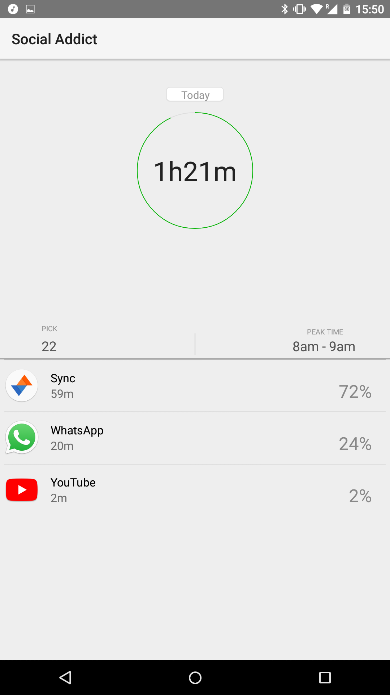
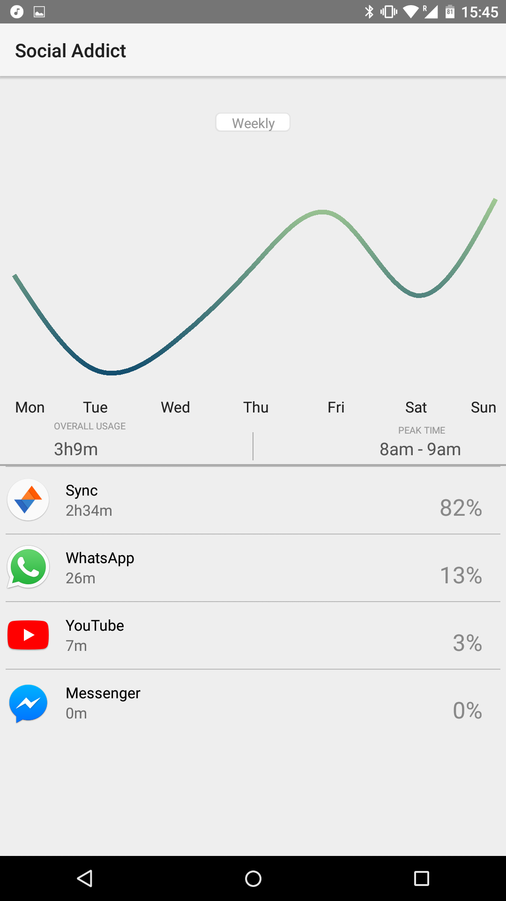
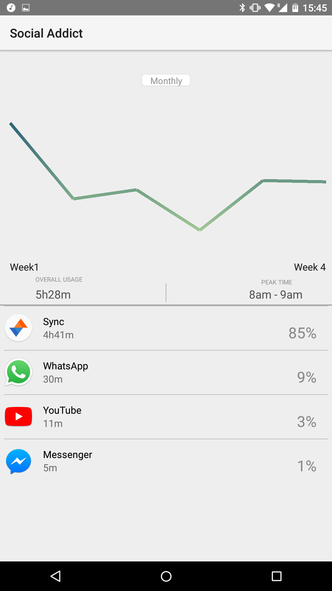
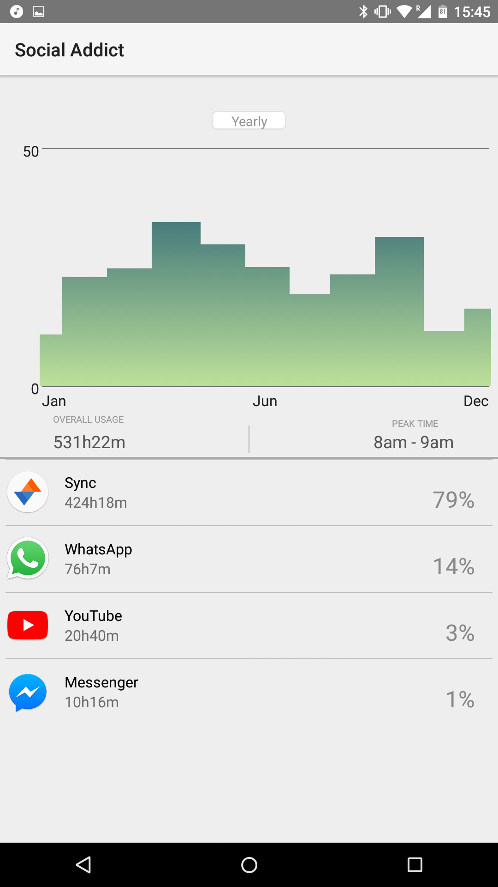

# SocialAddict
An example App for the UsageStatsManager Library tracking Social Media Usage

This App uses the Usage Statistics build into Android since API version 21 and vizualises them.  

This is still partially simulated as the data can be inaccurate, especially when trying to get it from the past.
While the daily, weekly and yearly data is often accurate, trying to split the week into seperate days, the months into weeks,
etc. does not produce consistent results on every phone. This could be fixed by saving the daily data and using it to improve 
the breakdown. The App also recognizes how often you pick up the phone while the App is active. The peak time is entirely 
simulated and thus not quite finished, as it cannot be extracted from the UsageStats.  
This App was build upon the Google Example AppUsageStatistics  
Design by Hong Shu and Yi He, programming by Finn Ickler
